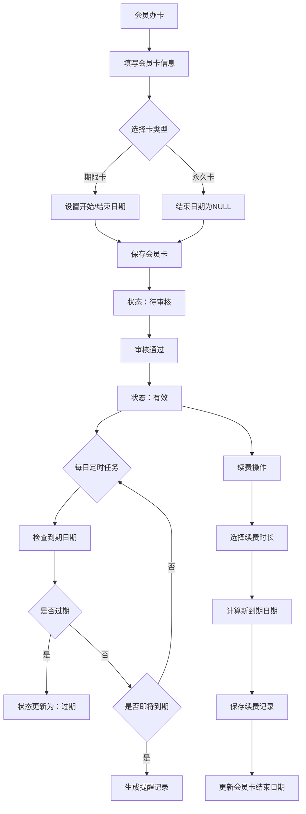

## 产品概述

完善健身房管理系统的会员卡业务模块，使其符合实际健身房的运营需求，支持会员卡全生命周期管理。

## 核心功能

- **会员卡有效期管理**：增加开始日期、到期日期字段，系统自动计算并管理会员卡状态（有效/过期/停用/待审核）
- **续费/续卡功能**：支持会员卡到期前的续费操作，自动延长到期日期，记录续费历史
- **会员卡类型支持**：支持期限卡（月卡、季卡、年卡）和永久卡两种类型
- **到期自动提醒**：系统自动检测即将到期的会员卡，提供提醒功能（7天、3天、1天前提醒）
- **会员卡状态管理**：根据到期日期自动更新状态，支持手动停用/启用操作

## 技术栈

- 后端：Spring Boot + MyBatis-Plus + MySQL
- 前端：Vue.js + Element UI
- 定时任务：Spring Boot 定时任务（@Scheduled）

## 实现方案

### 数据库设计

#### 1. 修改 huiyuanka 表结构

```sql
ALTER TABLE huiyuanka ADD COLUMN start_date DATE COMMENT '开始日期';
ALTER TABLE huiyuanka ADD COLUMN end_date DATE COMMENT '到期日期';
ALTER TABLE huiyuanka ADD COLUMN card_status VARCHAR(20) DEFAULT '待审核' COMMENT '卡片状态：有效/过期/停用/待审核';
ALTER TABLE huiyuanka ADD COLUMN card_type VARCHAR(20) DEFAULT '期限卡' COMMENT '卡片类型：期限卡/永久卡';
ALTER TABLE huiyuanka ADD COLUMN renewal_count INT DEFAULT 0 COMMENT '续费次数';
```

#### 2. 新增 huiyuanka_renewal 续费记录表

```sql
CREATE TABLE huiyuanka_renewal (
  id BIGINT PRIMARY KEY AUTO_INCREMENT COMMENT '主键',
  huiyuanka_id BIGINT COMMENT '会员卡ID',
  huiyuanzhanghao VARCHAR(200) COMMENT '会员账号',
  old_end_date DATE COMMENT '原到期日期',
  new_end_date DATE COMMENT '新到期日期',
  renewal_amount DECIMAL(10,2) COMMENT '续费金额',
  renewal_days INT COMMENT '续费天数',
  renewal_date DATETIME DEFAULT CURRENT_TIMESTAMP COMMENT '续费日期',
  remark VARCHAR(500) COMMENT '备注',
  KEY idx_huiyuanka_id (huiyuanka_id)
) ENGINE=InnoDB DEFAULT CHARSET=utf8mb4 COMMENT='会员卡续费记录';
```

#### 3. 新增 huiyuanka_reminder 提醒记录表

```sql
CREATE TABLE huiyuanka_reminder (
  id BIGINT PRIMARY KEY AUTO_INCREMENT COMMENT '主键',
  huiyuanka_id BIGINT COMMENT '会员卡ID',
  huiyuanzhanghao VARCHAR(200) COMMENT '会员账号',
  reminder_type VARCHAR(20) COMMENT '提醒类型：7天前/3天前/1天前',
  reminder_date DATE COMMENT '应提醒日期',
  is_sent TINYINT DEFAULT 0 COMMENT '是否已发送：0未发送/1已发送',
  sent_time DATETIME COMMENT '发送时间',
  KEY idx_huiyuanka_id (huiyuanka_id),
  KEY idx_reminder_date (reminder_date)
) ENGINE=InnoDB DEFAULT CHARSET=utf8mb4 COMMENT='会员卡到期提醒记录';
```

### 后端实现

#### 实体类修改（HuiyuankaEntity.java）

- 新增字段：startDate, endDate, cardStatus, cardType, renewalCount
- 添加字段校验注解

#### Service层新增功能

- `updateCardStatus()` - 更新会员卡状态（定时任务调用）
- `renewCard()` - 会员卡续费
- `getExpiringCards()` - 获取即将到期的会员卡
- `sendReminder()` - 发送到期提醒

#### 定时任务实现

- 每天凌晨自动执行状态更新任务
- 每天检查并发送到期提醒

#### Controller层新增接口

- `POST /huiyuanka/renew` - 会员卡续费
- `GET /huiyuanka/expiring` - 查询即将到期的会员卡
- `POST /huiyuanka/updateStatus` - 手动更新状态

### 前端实现

#### 列表页面修改（list.vue）

- 新增列：开始日期、到期日期、卡片状态、卡片类型
- 状态列使用标签样式展示
- 新增"续费"操作按钮

#### 新增续费页面/弹窗

- 显示当前会员卡信息
- 选择续费时长
- 确认续费操作

### 架构设计



## 目录结构

```
back/src/main/java/com/
├── controller/
│   └── HuiyuankaController.java          [MODIFY]
├── entity/
│   ├── HuiyuankaEntity.java             [MODIFY]
│   ├── HuiyuankaRenewalEntity.java     [NEW]
│   └── HuiyuankaReminderEntity.java    [NEW]
├── dao/
│   ├── HuiyuankaDao.java               [MODIFY]
│   ├── HuiyuankaRenewalDao.java        [NEW]
│   └── HuiyuankaReminderDao.java       [NEW]
├── service/
│   ├── HuiyuankaService.java           [MODIFY]
│   ├── HuiyuankaRenewalService.java    [NEW]
│   ├── HuiyuankaReminderService.java   [NEW]
│   └── impl/
│       ├── HuiyuankaServiceImpl.java   [MODIFY]
│       ├── HuiyuankaRenewalServiceImpl.java [NEW]
│       └── HuiyuankaReminderServiceImpl.java [NEW]
└── task/
    └── CardStatusTask.java            [NEW]

front/src/views/modules/huiyuanka/
├── list.vue                           [MODIFY]
├── add-or-update.vue                  [MODIFY]
└── renewal.vue                        [NEW]
```

## 设计风格

采用现代简约风格，与现有系统保持一致的紫色渐变主题（#667eea 到 #764ba2）。

## 页面设计

### 1. 会员卡列表页面（list.vue修改）

- 新增"卡片状态"列，使用 el-tag 展示不同颜色：
- 有效：绿色标签
- 过期：红色标签
- 停用：灰色标签
- 待审核：橙色标签
- 新增"到期日期"列，即将过期的行使用橙色背景高亮
- 操作列新增"续费"按钮（仅有效状态的卡片可操作）
- 搜索区域新增状态筛选下拉框

### 2. 会员卡新增/编辑页面（add-or-update.vue修改）

- 新增"卡片类型"单选框（期限卡/永久卡）
- 选择期限卡时，显示"有效天数"输入框和日期选择器
- 新增"开始日期"和"到期日期"日期选择器
- 永久卡类型时，到期日期自动禁用

### 3. 续费页面（renewal.vue新增）

- 展示当前会员卡信息和剩余天数
- 续费时长选择：月卡（+30天）、季卡（+90天）、年卡（+365天）
- 自定义续费天数输入
- 显示续费金额并确认续费
- 展示历史续费记录表格

## 交互设计

- 列表页状态使用标签色彩区分，一目了然
- 到期提醒：列表页即将过期的行自动高亮
- 续费操作：点击续费按钮弹出对话框，操作完成后自动刷新
- 状态变更：提供操作确认对话框，防止误操作